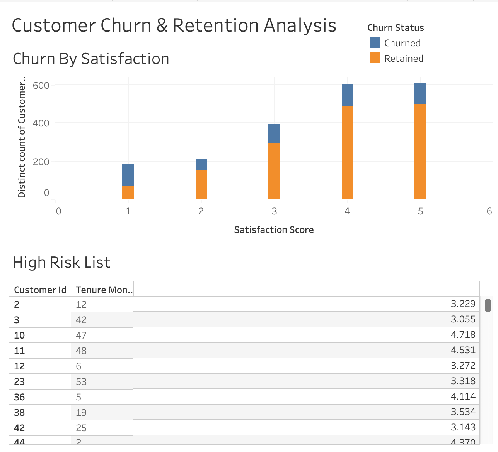

# Customer Churn & Retention Analysis

### Executive Summary
This project focuses on reducing customer attrition for a subscription-based service. Using **RFM (Recency, Frequency, Monetary)** analysis and SQL window functions, I segmented customers by risk level. The analysis highlights that customers with low satisfaction scores (1-2) within their first 6 months are at the highest risk, providing the marketing team with a targeted list for retention campaigns.

### Tools Used
* **SQL:** Advanced window functions (NTILE, RANK) for RFM segmentation.
* **R:** Statistical analysis of churn drivers.
* **Tableau:** Dashboarding to track high-risk customer segments.

### Dashboard

### Key Files
* `customer_rfm_analysis.sql`: SQL script for RFM segmentation and churn scoring.
* `churn_prediction_model.Rmd`: The R analysis of satisfaction trends.
